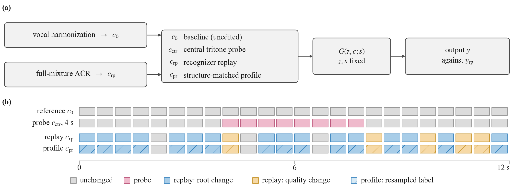
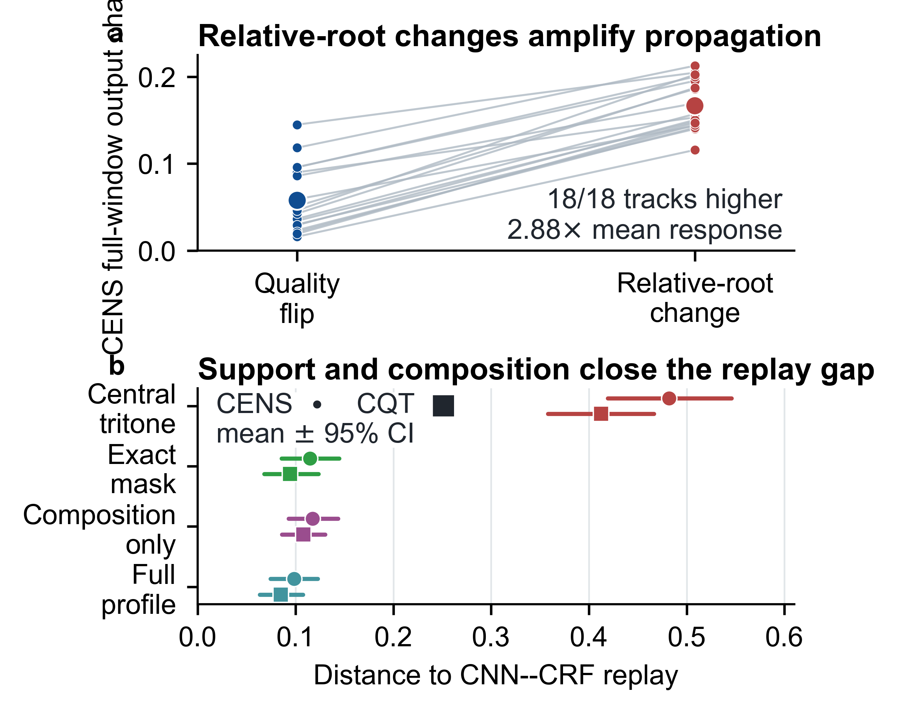

# Local chord corruption and recognizer replay

Reproducible analyses for studying how chord-condition changes propagate through
singing accompaniment generation. The repository compares a localized synthetic
chord edit with replay of a complete automatic chord-recognizer sequence under
matched track, seed, generation context, and scoring-window conditions.

## Why this comparison matters

A four-second chord edit is useful when the goal is to isolate a named harmonic
relation. It is not, however, the same input as the heterogeneous chord stream
produced by an automatic recognizer. This project makes that distinction
measurable and provides a support-and-profile-matched synthetic construction
that tracks recognizer replay more closely.

## Headline results

| Finding | Result |
|---|---:|
| Central tritone minus CNN--CRF replay (CENS changed-target effect) | **0.462** mean gap; positive on **29/30** tracks |
| Relative-root versus same-root quality control | **2.88x** larger CENS full-window response |
| CNN--CRF profile-matching gain | **0.384 / 0.328** in CENS / CQT |
| DeepChroma+CRF profile-matching gain | **0.408 / 0.353** in CENS / CQT |
| Lowest CENS replay distance | **0.098** with joint support-and-profile matching |

The central conclusion is straightforward: local edits measure sensitivity to a
specific harmonic intervention, whereas complete recognizer replay measures
behavior under the control stream delivered to a deployed generator. Support and
relation composition connect the two settings.

## What the numbers show

The comparison is run track-by-track with the same vocal excerpt, generation
context, random seed, and scoring window. A central four-second tritone therefore
answers a deliberately narrow question: *how does the generator react to this
one harmonic change?* In contrast, recognizer replay keeps the full predicted
chord stream, including its timing, repeated labels, and mixed relations. The
0.462 CENS gap (positive on 29 of 30 tracks) shows that these probes are not
interchangeable. The relation control further shows that the generator responds
to the root relationship itself: relative-root changes produce 2.88 times the
full-window response of same-root quality flips.

Profile matching closes most of the remaining gap. Matching both the recognizer's
temporal support and its relation profile improves agreement with replay for
both CNN--CRF and DeepChroma+CRF paths, reaching a minimum CENS distance of
0.098. In practical terms, a compact synthetic probe can be useful—but only
after it preserves the structure of the control stream it is meant to represent.

## Practical takeaway

Use local corruption when you need a clean, interpretable sensitivity test. Use
complete recognizer replay when you want to measure behavior under a deployed
automatic chord interface. If a lightweight proxy is required for a larger
evaluation, construct it from the recognizer's support and relation statistics;
otherwise the proxy can overstate or mischaracterize downstream response.

<p align="center">
  
</p>

<p align="center">
  
</p>

## Quick start

```bash
python -m pip install -r requirements.txt
python scripts/run_reproduction.py
```

The command recomputes the reported track-level summaries and figures from the
included derived metric tables, writing fresh outputs to `reproduced/`. Expected
checks and output locations are listed in [REPRODUCTION.md](REPRODUCTION.md).

## Repository layout

- `data/` — derived metric tables used by the released analyses.
- `analysis/` and `scripts/` — track-level inference and figure-generation code.
- `results/` — final figures and compact summary values.

The repository intentionally contains no audio, model checkpoints, or
third-party recognizer implementations. Those components must be obtained under
their original licenses for audio-level regeneration.

## License

Code is released under the MIT License. Derived tables and figures are released
under CC BY 4.0; see [DATA_LICENSE.md](DATA_LICENSE.md).
