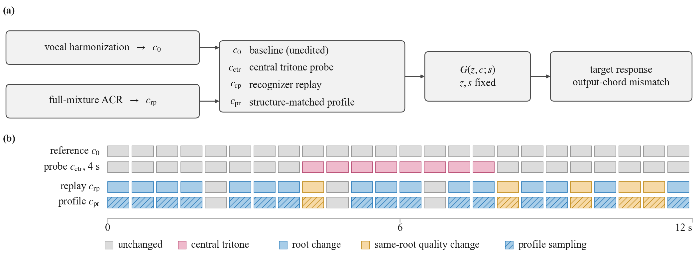

# Local chord corruption and recognizer replay

[Paper](https://arxiv.org/abs/2609.03584) · [Reproduction](REPRODUCTION.md) · [Result data](data/moisesdb)

Tools and derived measurements for evaluating chord-conditioned music generation.
Compare a local chord edit with a complete recognized chord sequence, then construct
a synthetic profile that matches where chords change and how they relate to baseline.

<p align="center">
  
</p>

## Results

On MUSDB18-HQ, central four-second tritone corruption produces a larger target
response than replay on **29 of 30 songs**. Structure matching reduces CENS
target-response distance to replay from **0.482 to 0.098**.

The independent 24-song MoisesDB evaluation covers two audio generators and a
beat-based symbolic accompaniment system:

| Generator | Central distance | Profile distance | Reduction | Songs closer to replay |
|---|---:|---:|---:|---:|
| MIDI-SAG | 0.4570 | **0.0877** | **81%** | **24/24** |
| MusicGen-Chord | 0.4361 | **0.0990** | **77%** | **24/24** |
| AccoMontage | 0.3675 | **0.0952** | **74%** | **23/24** |

Audio-model distances use CENS target response. AccoMontage uses a pitch-class
projection on its 48-beat interface; do not compare absolute distances across
these representations. Both audio-model primary tests have Holm-adjusted
**p = 2.38 × 10⁻⁷**. Replacing CNN–CRF with DeepChroma+CRF as the input recognizer
preserves improvement on **23/24** songs in each audio model.

### Why match both factors?

| Output chord mismatch with replay ↓ | Central | Temporal only | Relation only | Joint |
|---|---:|---:|---:|---:|
| MIDI-SAG | 86.11% | 80.56% | 83.16% | **66.20%** |
| MusicGen-Chord | 90.16% | 84.90% | 87.91% | **76.85%** |

Either factor removes much of the target-response mismatch. Joint matching brings
decoded output chords closer to replay than either factor alone (all four paired
comparisons: Holm-adjusted p ≤ 0.00231). The extra CENS gains are not significant.
Target response and output harmony capture different aspects of calibration;
neither is a listener-preference score.

## Installation and use

| Task | Start here |
|---|---|
| Recompute the released statistics (CPU) | Commands below |
| Construct chord conditions and generate new MusicGen-Chord audio | [Worked example](examples/README.md) |
| Install PyTorch and model dependencies | [Model environments](environments/README.md) |

### Recompute results

```bash
python -m pip install -r requirements.txt
python scripts/run_reproduction.py
```

For MoisesDB and AccoMontage only:

```bash
python scripts/analyze_moisesdb.py
```

No GPU or music downloads are needed for **metric-level reproduction**. The code
averages paired seeds per song before computing response distances, then recomputes
bootstrap intervals, exact signed-rank tests and Holm correction.
Outputs go to `reproduced/`.

## Using the comparison

1. Hold musical input, context and generation seed fixed.
2. Generate baseline, complete replay, local corruption and a matched profile.
3. Compare each synthetic condition's response with replay, not just baseline.
4. Check output chord agreement as well as target-response distance.

Local edits isolate a harmonic intervention. Complete replay tests the recognized
sequence. Structure matching connects these two evaluations without treating them
as interchangeable.

## Repository layout

| Directory | Contents |
|---|---|
| `data/` | Derived observations for the released analyses |
| `analysis/`, `scripts/` | Pairing checks, statistics and plotting code |
| `environments/` | Model-specific dependency versions and installation |
| `examples/`, `tests/` | Chord input example and condition-construction tests |
| `results/` | Selected figures and final numerical summaries |
| `reproduced/` | Local outputs; ignored by Git |

The six-song pilot and 24-song evaluation remain separate. The evaluation set was
fixed before pilot generation; proceeding to it followed a revision of the initial
stopping rule. No songs were replaced or pooled into the evaluation set.

## Data and licensing

Original music, weights and third-party recognizers are not redistributed.
Obtain [MUSDB18-HQ](https://zenodo.org/records/3338373) and
[MoisesDB](https://github.com/moises-ai/moises-db) under their providers' licenses.
The repository includes MusicGen-Chord inference, half-second chord-condition
construction and audio response scoring. MIDI-SAG and AccoMontage currently have
released measurements and statistical analyses; their portable generation and
input-preparation workflows are still being packaged.

Code: [MIT](LICENSE). Derived tables and figures: [CC BY 4.0](DATA_LICENSE.md).
These licenses do not replace third-party dataset or model licenses.

## Citation

The paper and its version history are at [arXiv:2609.03584](https://arxiv.org/abs/2609.03584).
Use the title and version shown there when citing the preprint.
